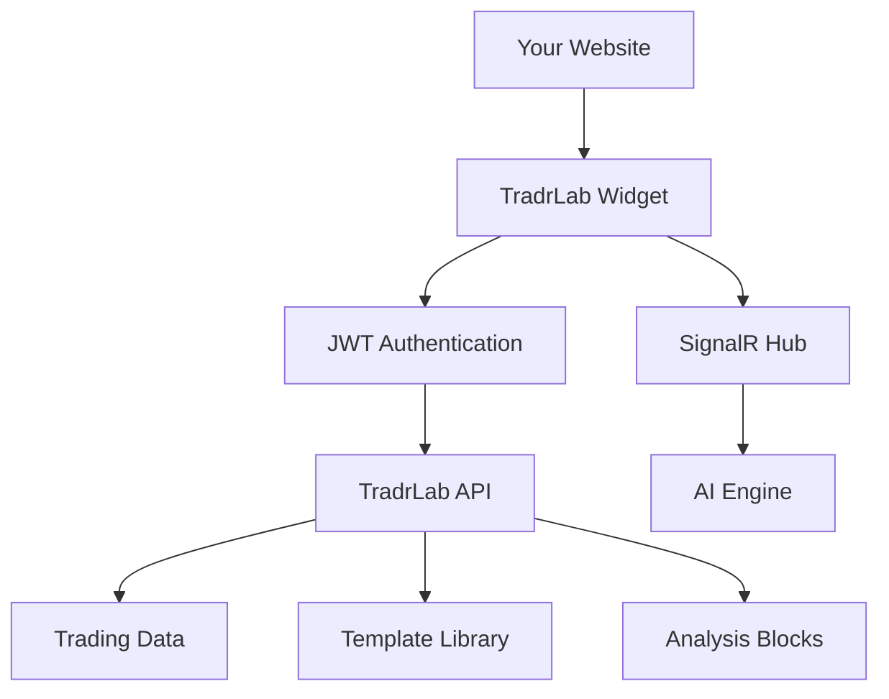

# TradrLab Widget

🚀 **Production-Ready** embeddable AI-powered trading strategy development widget.

## ✨ Features

- **🤖 AI-Powered Chat Interface** - Natural language strategy development
- **⚡ Real-time Communication** - SignalR integration for instant responses
- **🔐 JWT Authentication** - Secure API key-based authentication 
- **📊 Complete Data Integration** - 116+ symbols, templates, analysis blocks
- **🎯 Dual Journey Modes** - Interactive exploration + Template quick-start
- **🏭 Production Ready** - Full error handling, rate limiting, CORS support

## 🚀 Quick Start

### 1. Get API Access
Contact TradrLab at support@tradrlab.com to obtain your widget API key.

### 2. Basic Integration

```html
<!DOCTYPE html>
<html>
<head>
    <title>TradrLab Widget</title>
</head>
<body>
    <div id="widget-container"></div>

    <script src="dist/widget-core.min.js"></script>
    <script>
        // Configure global settings
        window.TradrLabWidget.globals({
            apikey: 'YOUR_API_KEY_HERE'
        });

        // Create widget instance
        const widget = window.TradrLabWidget.CreateWidget('chat', 
            document.getElementById('widget-container'), {
            
            externalUserId: 'user-123',  // Required: Your user's unique ID
            
            onWidgetReady: function(widget) {
                console.log('✅ Widget ready!');
            },
            onMessageReceived: function(message) {
                console.log('🤖 AI Response:', message);
            }
        });
    </script>
</body>
</html>
```

### 3. Test the Integration

Open the integration example to see the widget in action:
- **[`integration-example.html`](integration-example.html)** - Complete interactive demo
- Shows both Interactive and Template modes
- Demonstrates all API integrations and callbacks

## 📁 Files Included

```
tradrlab-widget/
├── dist/
│   ├── widget-core.min.js       # ✅ Production build (203KB)
│   └── widget-core.min.js.map   # Source maps for debugging
├── integration-example.html      # 🎯 Complete working example
├── INTEGRATION_GUIDE.md         # 📖 Complete API documentation
├── README.md                    # 📋 This file
└── LICENSE                      # ⚖️ License agreement
```

## 🎯 User Journey Modes

### Interactive Mode
1. **Chat**: User describes strategy in natural language
2. **Scenario**: AI refines ideas into logical steps (Milestone 1)
3. **Model**: System generates executable trading model (Milestone 2)
4. **Execution**: Model evaluated against market data (Milestone 3)
5. **Analysis**: User asks questions about results (Milestone 4)
6. **Backtesting**: Optional performance testing (Milestone 5)

### Template Mode
1. **Browse**: User selects from curated strategy templates
2. **Auto-Generation**: System automatically progresses through milestones 1-3
3. **Analysis**: User continues with questions and backtesting

## 🔧 API Integration

The widget automatically handles all backend integration:

- **✅ Authentication**: JWT token generation and management
- **✅ Data Loading**: 116+ trading symbols, timeframes, and templates
- **✅ Real-time Communication**: SignalR for instant AI responses
- **✅ Error Handling**: Comprehensive error management and recovery
- **✅ Rate Limiting**: Built-in quota management

## 🏗️ Architecture



## 📖 Documentation

- **[INTEGRATION_GUIDE.md](INTEGRATION_GUIDE.md)** - Complete API reference
- **[integration-example.html](integration-example.html)** - Live working example
- **API Swagger**: https://dev.api.tradrlab.com/api/swagger
- **Support**: support@tradrlab.com

## 🔐 Security & Authentication

### Authentication Flow
1. Widget validates your API key with TradrLab
2. System creates/retrieves user account via external user ID
3. Widget receives JWT token for authenticated access
4. All API calls and SignalR use JWT authentication

### Security Best Practices
- API keys are never exposed in client code
- JWT tokens are short-lived and automatically refreshed
- All communication uses HTTPS encryption
- Rate limiting prevents abuse

## 🌐 Browser Support

- **Chrome**: 90+
- **Firefox**: 88+
- **Safari**: 14+
- **Edge**: 90+

## 🚨 Requirements

- **HTTPS**: Required for secure API communication
- **API Key**: Must be obtained from TradrLab
- **Unique User IDs**: Each user needs a unique external identifier
- **CORS**: Your domain must be whitelisted for API access

## 📊 Usage Examples

### Basic Chat Interface
```javascript
const widget = window.TradrLabWidget.CreateWidget('chat', container, {
    externalUserId: 'user-123'
});

widget.sendMessage('Create a momentum strategy for EURUSD');
```

### Advanced Event Handling
```javascript
const widget = window.TradrLabWidget.CreateWidget('chat', container, {
    externalUserId: 'user-123',
    onMessageReceived: function(message) {
        switch(message.messageType) {
            case 'Scenario':
                console.log('✅ Strategy scenario created');
                break;
            case 'Model':
                console.log('🔧 Trading model generated');
                break;
            case 'ExecutionResult':
                console.log('📊 Strategy executed:', message);
                break;
        }
    }
});
```

### Multiple Users
```javascript
// For multi-user applications
const widget = window.TradrLabWidget.CreateWidget('chat', container, {
    externalUserId: `user-${getCurrentUser().id}`
});
```

## 🔍 Troubleshooting

### Widget Not Loading
- ✅ Verify script path and HTTPS
- ✅ Check API key validity
- ✅ Ensure external user ID is provided

### SignalR Connection Issues
- ✅ Check browser console for WebSocket errors
- ✅ Verify JWT token generation
- ✅ Confirm firewall allows WebSocket connections

### No AI Responses
- ✅ Monitor `onSignalRConnected` callback
- ✅ Check for rate limiting errors
- ✅ Verify API quota availability

## 📞 Support

- **Email**: support@tradrlab.com
- **Documentation**: https://docs.tradrlab.com
- **API Status**: https://status.tradrlab.com
- **Issues**: Create issue in this repository

## 📋 Changelog

### Version 1.0.0 (Current)
- ✅ Initial production release
- ✅ Complete AI chat functionality
- ✅ JWT authentication & user management
- ✅ Interactive and Template modes
- ✅ Real-time SignalR communication
- ✅ Full API integration (116+ symbols, templates, blocks)
- ✅ Production-ready error handling

## 📄 License

**Proprietary Software** - Usage requires valid API key and agreement to TradrLab's Terms of Service.

Contact: legal@tradrlab.com for licensing information.

---

**Ready to integrate?** 🚀 Start with `integration-example.html` and the [Integration Guide](INTEGRATION_GUIDE.md)!